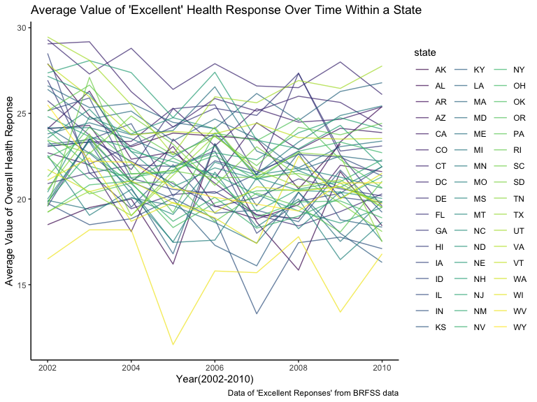

p8105_hw3_cw3555
================
Eunice Wang
`2023-10-14`

``` r
library(tidyverse)
```

    ## ── Attaching core tidyverse packages ──────────────────────── tidyverse 2.0.0 ──
    ## ✔ dplyr     1.1.3     ✔ readr     2.1.4
    ## ✔ forcats   1.0.0     ✔ stringr   1.5.0
    ## ✔ ggplot2   3.4.3     ✔ tibble    3.2.1
    ## ✔ lubridate 1.9.2     ✔ tidyr     1.3.0
    ## ✔ purrr     1.0.2     
    ## ── Conflicts ────────────────────────────────────────── tidyverse_conflicts() ──
    ## ✖ dplyr::filter() masks stats::filter()
    ## ✖ dplyr::lag()    masks stats::lag()
    ## ℹ Use the conflicted package (<http://conflicted.r-lib.org/>) to force all conflicts to become errors

``` r
library(ggridges)
library(patchwork)

library(p8105.datasets)

knitr::opts_chunk$set(
    echo = TRUE,
    warning = FALSE,
    fig.width = 8, 
  fig.height = 6,
  out.width = "90%"
)

theme_set(theme_minimal() + theme(legend.position = "bottom"))

options(
  ggplot2.continuous.colour = "viridis",
  ggplot2.continuous.fill = "viridis"
)

scale_colour_discrete = scale_colour_viridis_d
scale_fill_discrete = scale_fill_viridis_d
```

### Problem 1

#### Read in the data

``` r
data("instacart")

instacart = 
  instacart |> 
  as_tibble()
```

#### Answer questions about the data

This dataset contains 1384617 rows and 15 columns, with each row
representing a single product from an instacart order. Variables include
identifiers for user, order, and product; the order in which each
product was added to the cart. There are several order-level variables,
describing the day and time of the order, and number of days since prior
order. Then there are several item-specific variables, describing the
product name (e.g. Yogurt, Avocado), department (e.g. dairy and eggs,
produce), and aisle (e.g. yogurt, fresh fruits), and whether the item
has been ordered by this user in the past. In total, there are 39123
products found in 131209 orders from 131209 distinct users.

Below is a table summarizing the number of items ordered from aisle. In
total, there are 134 aisles, with fresh vegetables and fresh fruits
holding the most items ordered by far.

``` r
instacart |> 
  count(aisle) |> 
  arrange(desc(n))
```

    ## # A tibble: 134 × 2
    ##    aisle                              n
    ##    <chr>                          <int>
    ##  1 fresh vegetables              150609
    ##  2 fresh fruits                  150473
    ##  3 packaged vegetables fruits     78493
    ##  4 yogurt                         55240
    ##  5 packaged cheese                41699
    ##  6 water seltzer sparkling water  36617
    ##  7 milk                           32644
    ##  8 chips pretzels                 31269
    ##  9 soy lactosefree                26240
    ## 10 bread                          23635
    ## # ℹ 124 more rows

Next is a plot that shows the number of items ordered in each aisle.
Here, aisles are ordered by ascending number of items.

``` r
instacart |> 
  count(aisle) |> 
  filter(n > 10000) |> 
  mutate(aisle = fct_reorder(aisle, n)) |> 
  ggplot(aes(x = aisle, y = n)) + 
  geom_point() + 
  labs(title = "Number of items ordered in each aisle") +
  theme(axis.text.x = element_text(angle = 60, hjust = 1))
```


Our next table shows the three most popular items in aisles
`baking ingredients`, `dog food care`, and `packaged vegetables fruits`,
and includes the number of times each item is ordered in your table.

``` r
instacart |> 
  filter(aisle %in% c("baking ingredients", "dog food care", "packaged vegetables fruits")) |>
  group_by(aisle) |> 
  count(product_name) |> 
  mutate(rank = min_rank(desc(n))) |> 
  filter(rank < 4) |> 
  arrange(desc(n)) |>
  knitr::kable()
```

| aisle                      | product_name                                  |    n | rank |
|:---------------------------|:----------------------------------------------|-----:|-----:|
| packaged vegetables fruits | Organic Baby Spinach                          | 9784 |    1 |
| packaged vegetables fruits | Organic Raspberries                           | 5546 |    2 |
| packaged vegetables fruits | Organic Blueberries                           | 4966 |    3 |
| baking ingredients         | Light Brown Sugar                             |  499 |    1 |
| baking ingredients         | Pure Baking Soda                              |  387 |    2 |
| baking ingredients         | Cane Sugar                                    |  336 |    3 |
| dog food care              | Snack Sticks Chicken & Rice Recipe Dog Treats |   30 |    1 |
| dog food care              | Organix Chicken & Brown Rice Recipe           |   28 |    2 |
| dog food care              | Small Dog Biscuits                            |   26 |    3 |

Finally is a table showing the mean hour of the day at which Pink Lady
Apples and Coffee Ice Cream are ordered on each day of the week. This
table has been formatted in an untidy manner for human readers. Pink
Lady Apples are generally purchased slightly earlier in the day than
Coffee Ice Cream, with the exception of day 5.

``` r
instacart |>
  filter(product_name %in% c("Pink Lady Apples", "Coffee Ice Cream")) |>
  group_by(product_name, order_dow) |>
  summarize(mean_hour = mean(order_hour_of_day)) |>
  pivot_wider(
    names_from = order_dow, 
    values_from = mean_hour) |>
  knitr::kable(digits = 2)
```

    ## `summarise()` has grouped output by 'product_name'. You can override using the
    ## `.groups` argument.

| product_name     |     0 |     1 |     2 |     3 |     4 |     5 |     6 |
|:-----------------|------:|------:|------:|------:|------:|------:|------:|
| Coffee Ice Cream | 13.77 | 14.32 | 15.38 | 15.32 | 15.22 | 12.26 | 13.83 |
| Pink Lady Apples | 13.44 | 11.36 | 11.70 | 14.25 | 11.55 | 12.78 | 11.94 |

### Problem 2

#### Read in the data

``` r
data("brfss_smart2010")
```

#### Data cleaning

``` r
brfss_smart2010_df = 
  brfss_smart2010 |> 
  janitor::clean_names() |> 
  filter(
    topic=="Overall Health",
    response %in% c("Excellent","Very good","Good","Fair","Poor")
 ) |> 
mutate(
  response = factor(response, levels= c("Poor", "Fair", "Good", "Very good", "Excellent"), ordered= TRUE)
 )
```

#### Using data to answer the following questions

- Q: In 2002, which states were observed at 7 or more locations?

``` r
brfss_smart2010_df |> 
  filter(year==2002) |> 
  group_by(year, locationabbr) |> 
  summarize(distinct_locations = n_distinct(locationdesc)) |> 
  filter(distinct_locations>=7)|> 
  knitr::kable()
```

    ## `summarise()` has grouped output by 'year'. You can override using the
    ## `.groups` argument.

| year | locationabbr | distinct_locations |
|-----:|:-------------|-------------------:|
| 2002 | CT           |                  7 |
| 2002 | FL           |                  7 |
| 2002 | MA           |                  8 |
| 2002 | NC           |                  7 |
| 2002 | NJ           |                  8 |
| 2002 | PA           |                 10 |

- A: In 2002, total 6 states are observed at 7 or more locations: CT,
  FL, MA, NC, NJ, PA.

- Q: What about in 2010?

``` r
brfss_smart2010_df |> 
  filter(year==2010) |> 
  group_by(year, locationabbr) |> 
  summarize(distinct_locations = n_distinct(locationdesc)) |> 
  filter(distinct_locations>=7) |> 
  knitr::kable()
```

    ## `summarise()` has grouped output by 'year'. You can override using the
    ## `.groups` argument.

| year | locationabbr | distinct_locations |
|-----:|:-------------|-------------------:|
| 2010 | CA           |                 12 |
| 2010 | CO           |                  7 |
| 2010 | FL           |                 41 |
| 2010 | MA           |                  9 |
| 2010 | MD           |                 12 |
| 2010 | NC           |                 12 |
| 2010 | NE           |                 10 |
| 2010 | NJ           |                 19 |
| 2010 | NY           |                  9 |
| 2010 | OH           |                  8 |
| 2010 | PA           |                  7 |
| 2010 | SC           |                  7 |
| 2010 | TX           |                 16 |
| 2010 | WA           |                 10 |

- A: In 2002, total 14 states are observed at 7 or more locations: CA,
  CO, FL, MA, MD, NC, NE, NJ, NY, OH, PA, SC, TX, WA.

- Q: Construct a dataset that is limited to Excellent responses, and
  contains, year, state, and a variable that averages the data_value
  across locations within a state. Make a “spaghetti” plot of this
  average value over time within a state (that is, make a plot showing a
  line for each state across years – the geom_line geometry and group
  aesthetic will help).

``` r
brfss_excellent_repsonse_df=
  brfss_smart2010_df |> 
  filter(response=="Excellent") |> 
  group_by(year, locationabbr) |> 
  summarize(mean_value = mean(data_value, na.rm =TRUE))
```

    ## `summarise()` has grouped output by 'year'. You can override using the
    ## `.groups` argument.

``` r
brfss_excellent_repsonse_df |> 
  ggplot(aes(x=year, y=mean_value, color= locationabbr))+
  geom_line(alpha=0.7)+
labs(
    title = "Average Value of 'Excellent' Health Response Over Time Within a State",
    x= "Year(2002-2010)",
    y= "Average Value of Overall Health Reponse",
    caption = "Data of 'Excellent Reponses' from BRFSS data"
  )+
   theme_classic()
```



A: This above “spaghetti” plot shows the average value of “excellent”
health response over time within a state. Each line with different
colors represent different states. Most states have a volatile pattern
from 2002-2010, containing both increasing and decreasing trends. Though
they all perceive their overall health as excellent, there are times
that they consider it to be improved and worsened.

- Q: Make a two-panel plot showing, for the years 2006, and 2010,
  distribution of data_value for responses (“Poor” to “Excellent”) among
  locations in NY State

``` r
brfss_2006_2010_NY_df =
  brfss_smart2010_df |> 
  filter(year%in% c("2006", "2010"), locationabbr == "NY") 

brfss_2006_2010_NY_df |> 
  ggplot(aes(x=response, y= data_value))+
  geom_boxplot()+
  facet_grid(.~ year)+
  labs(
    title = "Distirbution of Value of Health Response for 2006 and 2010 in NY",
    x= "Response(Poor-Excellent)",
    y= "Value of Overall Health Reponse",
    caption = "Data of 'Year 2006 & 2010 in NY' from BRFSS data"
  ) 
```


- A: This two-panel box plot shows the distribution of value of health
  response ((“Poor” to “Excellent”) for 2006 and 2010 in NY. Comparing
  the two panel, it can be inferred that there are some improvements in
  one’s perception of their over health comparing 2006 and 2010. The
  median value of “Very good” response increased and the 25th and 75th
  interquartile also increased. There are also slight increases in
  median value of “Fair”and “Good” response.
